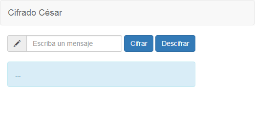
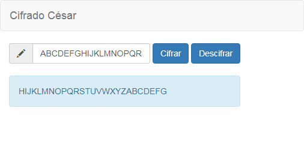

# Cifrado César

Se crea una web que, por medio de un `input`, solicita una frase al usuario y
devuelve el mismo mensaje encriptado según el
[algoritmo de Cifrado César](https://en.wikipedia.org/wiki/Caesar_cipher)
con el parámetro de desplazamiento de **33 espacios hacia la derecha**.

Por ejemplo:

- Texto original:   `ABCDEFGHIJKLMNOPQRSTUVWXYZ`
- Texto codificado: `HIJKLMNOPQRSTUVWXYZABCDEFG`
  
## Vistas

* Se solicita una frase al usuario:

* Se muestra la frase cifrada:

